# Lock锁

公平锁:  可以先来后到

非公平锁: 可以插队 (默认使用非公平锁)

# Synchronized 和 Lock 区别


1. Synchronized 内置的Java关键字, Lock 是一个Java类
2. Synchronized 无法判断获取锁的状态, Lock 可以判断是否获取到了锁
3. Synchronized 会自动释放锁,lock 必须要手动释放锁!如果不释放锁,会死锁!
4. Synchronized 线程1(获得锁,阻塞),线程2(等待,傻傻等...);Lock不一定会等待下去;
5. Synchronized  可重入锁,不可以中断的,非公平;Lock,可重入锁,可以 判断锁,非公平(可以自己设置)
6. Synchronized 适合锁少量的代码同步问题,Lock 适合锁大量的同步代码!

Synchronized的使用:

```java
//资源类 OOP
class Ticket{
    //属性、方法
    private int number = 50;


    //卖票的方式
    //synchronized 本质：队列和锁
    public synchronized void sale(){
        if (number>0){
            System.out.println(Thread.currentThread().getName()+"卖出了"+(number--)+"票,剩余："+number);
        }
    }
    
}
```

Lock锁的使用：

1、Lock lock = new ReentrantLock();

2、加锁 lock()

3、 try/catch/finally 包裹业务代码

4、finally 内 unlock()  //解锁

```java
class Ticket2 {
    //属性、方法
    private int number = 30;
    Lock lock = new ReentrantLock();
    //卖票的方式
    public void sale() {
        //加锁
        lock.lock();
        try {
            //业务代码
            if (number > 0) {
                System.out.println(Thread.currentThread().getName() + "卖出了" + (number--) + "票,剩余：" + number);
            }
        } catch (Exception e) {
            e.printStackTrace();
        } finally {
            lock.unlock(); //解锁
        }
    }
}
```


# 生产者消费者问题

重要: 单例模式,排序算法,生产者消费者问题,死锁

  传统生产者消费者问题:A , B ;加入C , D线程会出问题!(if 判断改为 while)

if判断只判断一次,多生产者和多消费者会一起进入业务代码


> JUC版 生产者消费者问题


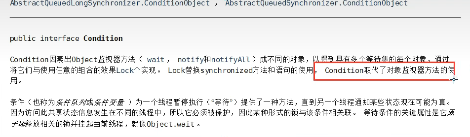


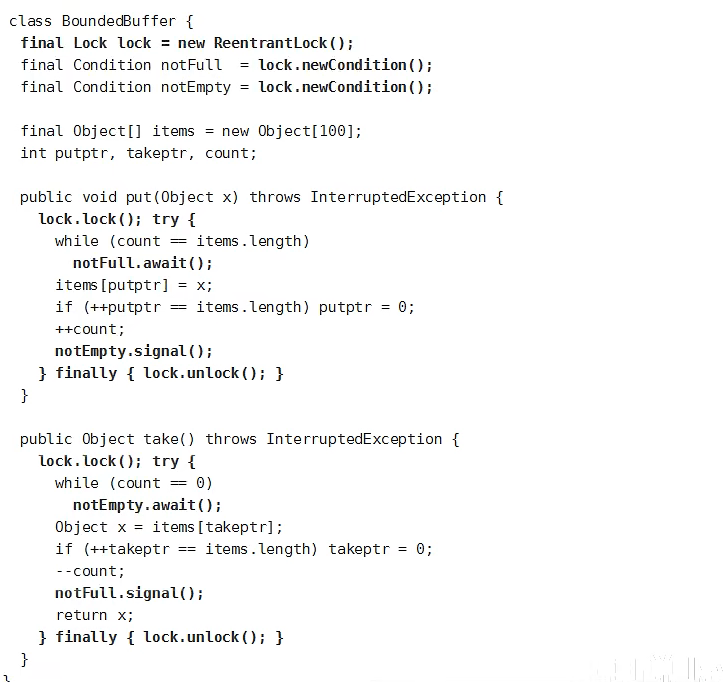


**Condition 可以精准的通知和唤醒线程**


>  8锁现象小结

new this 具体的一个手机

static Class 唯一的一个模板 

**看具体锁的是谁，是不是同一个锁！**


# 集合类不安全

> 1、List 不安全

多个线程调用的时候，list读取的时候是固定的，写入的时候会发生覆盖操作，所以并发下ArrayList 不安全，且会发生报错

解决方案：

```java
// 1、 List<String> list = new Vector<>();  //不推荐
// 2、 List<String> list = Collections.synchronizedList(new ArrayList<>());

List<String> list = new CopyOnWriteArrayList<>();

```

Vector 使用的是synchronized, CopyOnWrite 使用的是lock锁，所以效率上CopyOnWrite效率更加。

Vector 

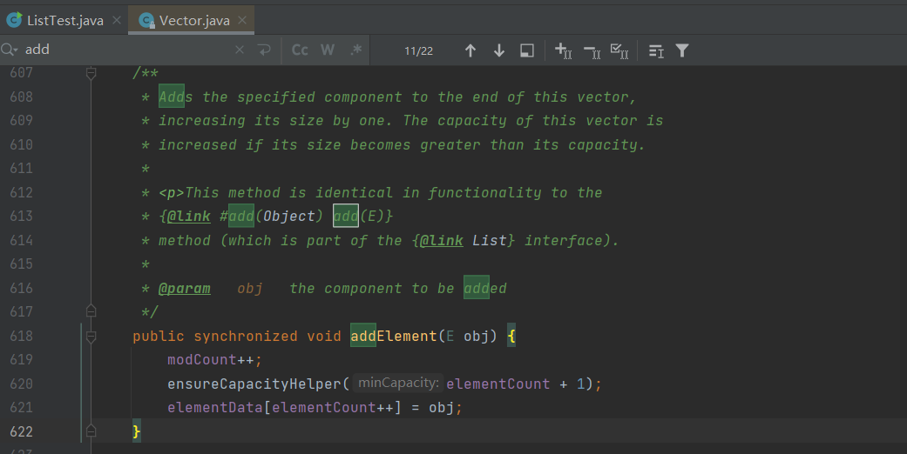

CopyOnWrite

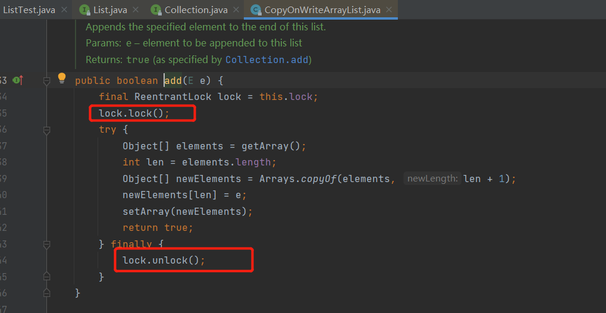


> 2、set  不安全

```java
/**
 * java.util.ConcurrentModificationException 并发修改异常
 *
 *  1、Set<String> set = Collections.synchronizedSet(new HashSet<>());
 *  2、Set<String> set = new CopyOnWriteArraySet<>();
 *
 */
```

hashSet 的底层 其实就是HashMap

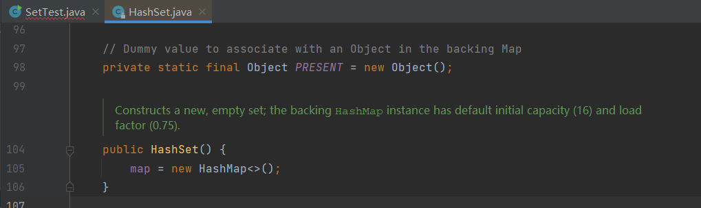


> 3、map 不安全


```java
Map<String, String> map = new ConcurrentHashMap<>();
```


# Callabel 

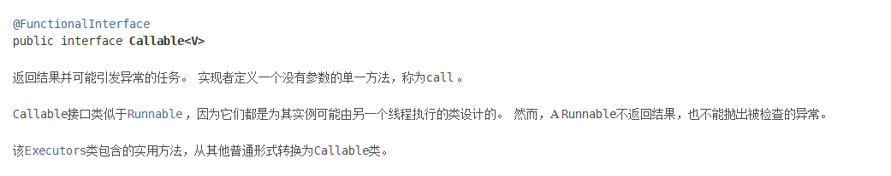

1、可以有返回值

2、可以抛出异常

3、方法不同，run()/call()

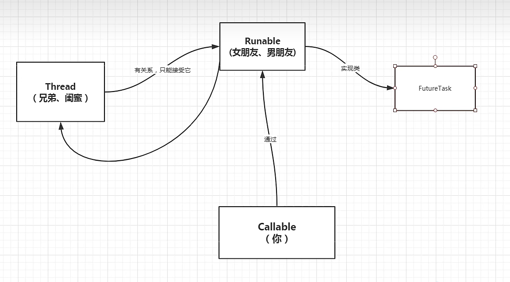


# 常用的辅助类


> #### CountDownLatch


```
public static void main(String[] args) throws InterruptedException {
        //总数是6
        CountDownLatch countDownLatch = new CountDownLatch(6);
        for (int i = 1; i <= 6 ; i++) {
            new Thread(()->{
                System.out.println(Thread.currentThread().getName()+" Go out");
                countDownLatch.countDown(); //-1
            },String.valueOf(i)).start();
        }
        countDownLatch.await(); //等待计数器归零再向下执行
        System.out.println("Close Door");


    }
```


> #### CyclicBarrier

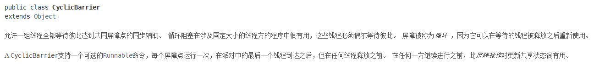

加法计数器


> #### Semaphore


信号量！

多个共享资源互斥！

```java
    public static void main(String[] args) {
        //六辆车抢三个车位
        Semaphore semaphore = new Semaphore(3);
        for (int i = 1; i <= 6 ; i++) {
            new Thread(()->{
                try {
                    semaphore.acquire(); //得到信号量
                    System.out.println(Thread.currentThread().getName()+"抢到车位");
                    TimeUnit.SECONDS.sleep(2);
                    System.out.println(Thread.currentThread().getName()+"离开车位");
                } catch (InterruptedException e) {
                    e.printStackTrace();
                } finally {
                    semaphore.release(); //释放信号量 +1操作
                }
            },String.valueOf(i)).start();

        }
    }
```


> #### ReadWriteLock

读写锁

读的时候可以多个线程一起读，写的时候只能有一个线程写！


```java
package com.ming.add;

import java.util.HashMap;
import java.util.Map;
import java.util.concurrent.locks.ReadWriteLock;
import java.util.concurrent.locks.ReentrantReadWriteLock;

/**
 * ReadWriteLock
 * 读-读 可以共存
 * 读-写 不能共存
 * 写-写 不能共存
 */
public class ReadWriteLockDemo {
    public static void main(String[] args) {
        MyCache myCache = new MyCache();
        //写入
        for (int i = 1; i <= 5 ; i++) {
            final int temp = i;
            new Thread(()->{
                myCache.put(temp+"",temp+"");

            },String.valueOf(i)).start();
        }

        //读取
        for (int i = 1; i <= 5 ; i++) {
            final int temp = i;
            new Thread(()->{
                myCache.get(temp+"");
            },String.valueOf(i)).start();
        }
    }
}

//加锁
class MyCache{
    private volatile Map<String ,Object> map = new HashMap<>();
    //读写锁
    private ReadWriteLock readWriteLock = new ReentrantReadWriteLock();
    //存 ，写过程
    public void put(String key,String value){
        readWriteLock.writeLock().lock();

        try {
            System.out.println(Thread.currentThread().getName()+"写入"+key);
            map.put(key,value);
            System.out.println(Thread.currentThread().getName()+"写入完毕");
        } catch (Exception e) {
            e.printStackTrace();
        } finally {
            readWriteLock.writeLock().unlock();
        }
    }

    //取，读过程s
    public void get(String key){
        readWriteLock.readLock().lock();

        try {
            System.out.println(Thread.currentThread().getName()+"读取"+key);
            Object o = map.get(key);
            System.out.println(Thread.currentThread().getName()+"读取完毕" + o);
        } catch (Exception e) {
            e.printStackTrace();
        } finally {
            readWriteLock.readLock().unlock();
        }

    }

}

```


# 阻塞队列

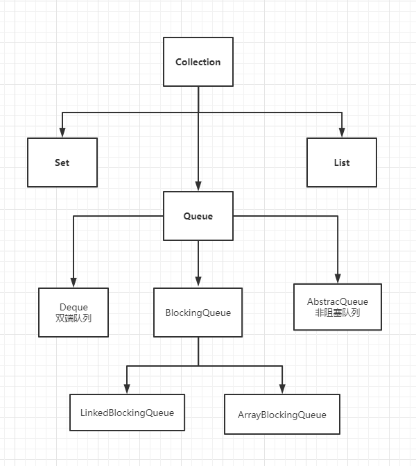


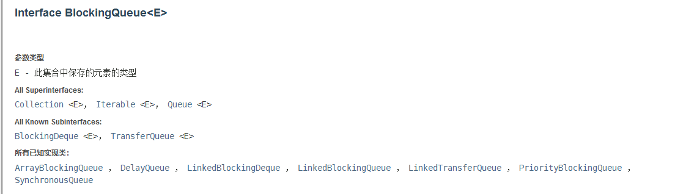


#### **BlockingQueue**

什么情况下 使用阻塞队列？ 多线程并发处理，线程池


学会使用队列：

​	添加、移除

**四组API：**

| 方式             | 抛出异常  | 有返回值,不抛出异常 | 阻塞 等待 | 超时等待     |
| ---------------- | --------- | ------------------- | --------- | ------------ |
| 添加             | add()     | offer()             | put()     | offer( , , ) |
| 移除             | remove()  | poll()              | take()    | poll( , )    |
| 判断是否队列首部 | element() | peek()              | -         | -            |


1. 抛出异常
2. 不会抛出异常
3. 阻塞等待
4. 超时等待


#### **SynchronousQueue**  同步队列

没有容量，

进去一个元素后必须等待取出来之后才能往里面放一个元素。

put、take

```java
/**
 *  同步队列
 *  和其他BlockingQueue 不一样，SynchronousQueue 不存储元素
 *  put了一个元素，必须从里面先take取出来，否则不能再put进去
 *  
 */
public class SynchronousQueueDemo {
    public static void main(String[] args) {
        BlockingQueue<String> blockingQueue = new SynchronousQueue<>();

        new Thread(()->{
            try {
                System.out.println(Thread.currentThread().getName() + " put 1");
                blockingQueue.put("1");
                System.out.println(Thread.currentThread().getName() + " put 2");
                blockingQueue.put("2");
                System.out.println(Thread.currentThread().getName() + " put 3");
                blockingQueue.put("3");
            } catch (InterruptedException e) {
                e.printStackTrace();
            }
        },"T1").start();

        new Thread(()->{
            try {
                TimeUnit.SECONDS.sleep(3);
                System.out.println(Thread.currentThread().getName()+"  "+blockingQueue.take());
                TimeUnit.SECONDS.sleep(3);
                System.out.println(Thread.currentThread().getName()+"  "+blockingQueue.take());
                TimeUnit.SECONDS.sleep(3);
                System.out.println(Thread.currentThread().getName()+"  "+blockingQueue.take());
            } catch (InterruptedException e) {
                e.printStackTrace();
            }
        },"T2").start();


    }
}
```


# 线程池

三大方法、七大参数、四种拒绝策略


> #### 池化技术

程序的运行，本质：占用系统的资源！优化资源的使用！=> 池化技术

线程池、连接池、内存池、对象池.......  创建销毁时十分浪费资源

池化技术： 事先准备好一些资源，有人要用就来这里拿，用完之后再还回来。

**线程池的好处：**

1. 降低资源的消耗
2. 提高响应速度
3. 方便管理

**线程复用、可以控制最大并发数、管理线程**


> #### 三大方法

1. Executors.newSingleThreadExecutor()
2. Executors.newFixedThreadPool(5)
3. Executors.newCachedThreadPool()

```java
// Executors 创建线程池工具类
//        ExecutorService threadPool = Executors.newSingleThreadExecutor(); //单个线程
//        ExecutorService threadPool = Executors.newFixedThreadPool(5);//创建一个固定的线程池大小
        ExecutorService threadPool = Executors.newCachedThreadPool();//可伸缩，自适应线程池大小
```


> #### 七大参数


三大方法的源码分析：

```java
public static ExecutorService newSingleThreadExecutor() {
    return new FinalizableDelegatedExecutorService
        (new ThreadPoolExecutor(1, 1,
                                0L, TimeUnit.MILLISECONDS,
                                new LinkedBlockingQueue<Runnable>()));
}


public static ExecutorService newFixedThreadPool(int nThreads) {
        return new ThreadPoolExecutor(nThreads, nThreads,
                                      0L, TimeUnit.MILLISECONDS,
                                      new LinkedBlockingQueue<Runnable>());
    }
    
    
public static ExecutorService newCachedThreadPool() {
        return new ThreadPoolExecutor(0, Integer.MAX_VALUE,   //约等于21亿 OOM 溢出
                                      60L, TimeUnit.SECONDS,
                                      new SynchronousQueue<Runnable>());
    }
    

```

本质上都是调用 ThreadPoolExecutor

```java
    public ThreadPoolExecutor(int corePoolSize, //核心线程池大小
                              int maximumPoolSize, //最大核心线程池大小
                              long keepAliveTime,  //超时等待，超时了没有人调用就会释放
                              TimeUnit unit, //超时单位
                              BlockingQueue<Runnable> workQueue, //阻塞队列
                              ThreadFactory threadFactory, //线程工厂
                              RejectedExecutionHandler handler) {   //拒绝策略
        if (corePoolSize < 0 ||
            maximumPoolSize <= 0 ||
            maximumPoolSize < corePoolSize ||
            keepAliveTime < 0)
            throw new IllegalArgumentException();
        if (workQueue == null || threadFactory == null || handler == null)
            throw new NullPointerException();
        this.corePoolSize = corePoolSize;
        this.maximumPoolSize = maximumPoolSize;
        this.workQueue = workQueue;
        this.keepAliveTime = unit.toNanos(keepAliveTime);
        this.threadFactory = threadFactory;
        this.handler = handler;
    }
```

一般线程池不允许使用Excutors 去创建，而是通过ThreadPoolExecutor 的方式，这样就可以更加的明确线程池的运行规则，避免资源耗尽的风险！

1. SingleThread 可能会堆积大量请求而导致OOM
2. ScheduledThread 则可能会创建了大量的线程导致OOM


> 手动创建线程池

```java
//手动创建线程池，自定义线程池
        //最大线程该如何定义：
        // 1、CPU密集型
        // 2、IO 密集型
        //获取CPU核数
        //System.out.println(Runtime.getRuntime().availableProcessors());
        ExecutorService threadPool = new ThreadPoolExecutor(
                2,       // corePoolSize 核心线程池大小
                5,		 //maximumPoolSize 最大核心线程池大小
                3,       //keepAliveTime 超时等待，超时了没有人调用就会释放
                TimeUnit.SECONDS,  //超时单位
                new LinkedBlockingDeque<>(3),  //阻塞队列
                Executors.defaultThreadFactory(),  //创建线程工厂
                new ThreadPoolExecutor.DiscardOldestPolicy()); //拒绝策略
```


> 4种拒绝策略

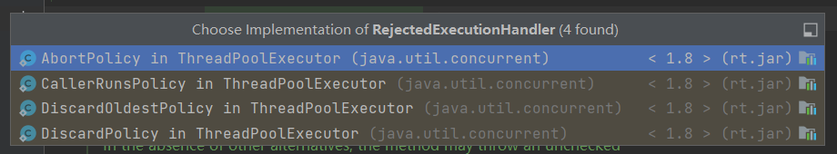

```java
/**
 * 
 * 1、AbortPolicy()  默认的拒绝策略 ， 队列满了还有人进来，不处理这个人，抛出异常             java.util.concurrent.RejectedExecutionException
 * 2、CallerRunsPolicy() 哪来的去哪里， main执行就main 线程处理 main ok
 * 3、DiscardPolicy() 队列满了不会丢出异常，会丢掉任务
 * 4、DiscardOldestPolicy() 队列满了，尝试去和最早的竞争 也不会抛出异常
 */
```


> 池的最大大小设置

IO密集型、CPU密集型（调优）


# 四大函数式接口


函数式接口：只有一个方法的接口。

简化编程模型，在新版本的框架底层大量运用

1. Function 函数型接口，有一个输入参数，有一个输出。
2. Predicate 断定型接口: 有一个输入参数，返回值只能是 布尔值。
3. Consumer 消费型接口： 只有传入参数，没有返回值。
4. Supplier 供给型接口： 没有传入参数，只有返回值。


# Stream流式计算

>什么是Stream流式计算？

大数据： 存储 + 计算

集合、Mysql 的本质是存储，计算应该交给流操作

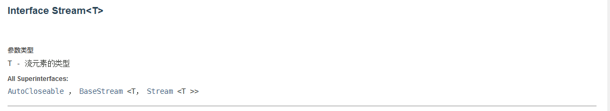

```java
/**
 *  现在有五个用户需要筛选：
 *  1、ID 必须是偶数
 *  2、年龄必须大于23岁
 *  3、用户名转为大写字母
 *  4、用户名字母倒着排序
 *  5、只输出一个用户！
 *
 */

public class Test {
    public static void main(String[] args) {
        User u1 = new User(1,"a",21);
        User u2 = new User(2,"b",22);
        User u3 = new User(3,"c",24);
        User u4 = new User(4,"d",26);
        User u5 = new User(6,"e",27);

        List<User> list = Arrays.asList(u1,u2,u3,u4,u5);

        list.stream()
                .filter(u->{return u.getId()%2==0;})  //断定型接口
                .filter(user -> {return user.getAge()>23;})
                .map(user -> {
                    user.setName(user.getName().toUpperCase(Locale.ROOT)); return user;
                }) //函数式接口
                .sorted((uu1,uu2) -> {return uu2.getName().compareTo(uu1.getName());})
                .limit(1) 
                .forEach(System.out::println);

    }
```


# ForkJoin

 ForkJoin --> 在jdk1.7之后，并行执行任务，提高效率！

大数据：Map Reduce(把大任务拆分成小任务)

 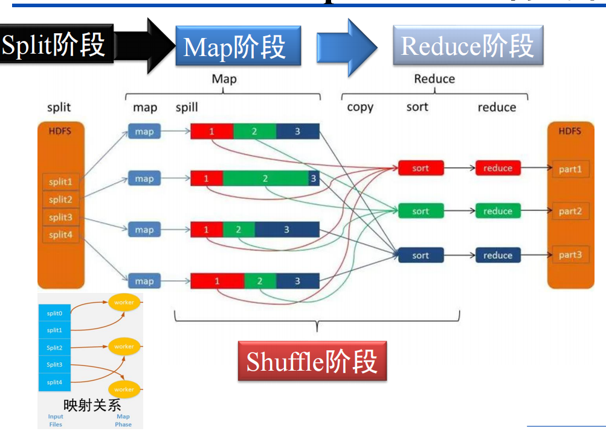

> ForkJoin 工作特点：工作窃取

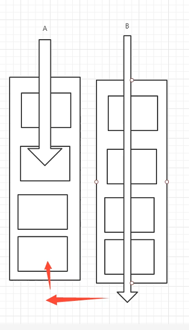


> ForkJoin 的使用


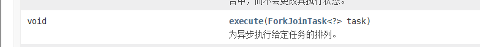


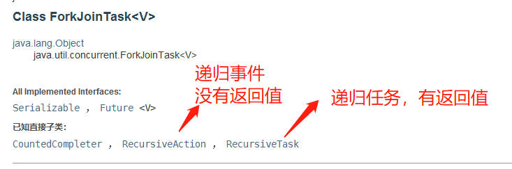

```java
/**
 * 如何使用 forkjoin?
 * 1、forkjoinPool 通过它来执行
 * 2、计算任务 forkjoinPoll.execute(ForkJoinTask task)
 * 3、计算类继承 ForkJoinTask （RecursiveTask、 RecursiveAction)
 *
 */

public class ForkJoinDemo extends RecursiveTask<Long> {
    private Long start;
    private Long end;

    //临界值
    private Long temp = 10000L;

    public ForkJoinDemo(Long start,Long end){
        this.start = start;
        this.end = end;
    }

    //计算方法
    @Override
    protected Long compute() {
        if ((end-start) < temp){
            Long sum = 0L;
            for (Long i = start; i <= end; i++) {
                sum += i;
            }
            return sum;
        }
        else{
            Long middle = (start + end) / 2;
            ForkJoinDemo task1 = new ForkJoinDemo(start,middle);
            task1.fork(); //拆分任务，把任务压入线程队列
            ForkJoinDemo task2 = new ForkJoinDemo(middle+1,end);
            task2.fork();
            return task1.join() + task2.join();
        }
    }
}
```

```java
//forkjoin sum=500000000500000000时间：4771  
    public static void test2() throws ExecutionException, InterruptedException {
        long start = System.currentTimeMillis();
        ForkJoinPool forkJoinPool = new ForkJoinPool();
        ForkJoinTask<Long> task = new ForkJoinDemo(0L, 10_0000_0000L);
        ForkJoinTask<Long> submit = forkJoinPool.submit(task);// 提交任务
        Long sum = submit.get();
        long end = System.currentTimeMillis();
        System.out.println("sum="+sum+"时间："+(end-start));
    }
```


# 异步回调

Future 设计初衷：对将来的某个事件的结果建模


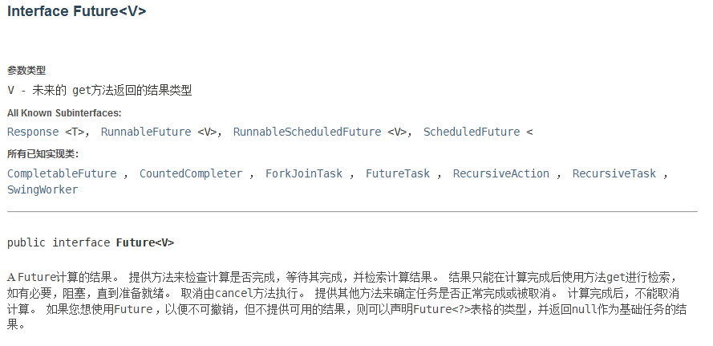

=======================================================================================

**CompletableFuture :**

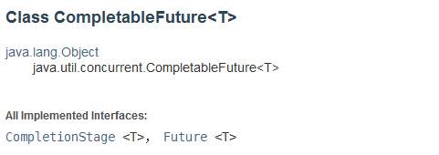

```java
/**
 *  异步调用 CompletableFuture
 *  //异步执行
 *  //成功回调
 *  //失败回调
 */
public class Demo01 {
    public static void main(String[] args) throws ExecutionException, InterruptedException {
//        //没有返回值的异步回调
//        CompletableFuture<Void> completableFuture = CompletableFuture.runAsync(()->{
//            try {
//                TimeUnit.SECONDS.sleep(2);
//            } catch (InterruptedException e) {
//                e.printStackTrace();
//            }
//            System.out.println(Thread.currentThread().getName()+"runAsync=>Void");
//        });
//        System.out.println("11111"); //这里会先打印出来然后阻塞等待异步执行
//        completableFuture.get(); //获取执行结果

        // 有返回值. supplyAsync 异步回调
        // 成功和失败的回调
        // 返回的是错误信息
        CompletableFuture<Integer> completableFuture = CompletableFuture.supplyAsync(()->{
            System.out.println(Thread.currentThread().getName()+"completableFuture=>Integer");
            int i = 10/0;
            return 1024;
        });

        completableFuture.whenComplete((t,u)->{
            System.out.println("t=>"+t);  //编译成功时回调的t 是正常成功的返回值   异常时t为null
            System.out.println("u=>"+u); //没有错误时是null , 错误时u为错误信息 u=>java.util.concurrent.CompletionException: java.lang.ArithmeticException: / by zero
        }).exceptionally(e->{
            System.out.println(e.getMessage()); //打印错误信息
            return 233; // 当错误时可以返回错误结果
        });
        /**
         *  200 500 404
         */


    }
}
```


个人理解：有点类似于ES6的 Promise 


# JMM


#### Volatile? 

=> 是Java虚拟机轻量级的同步机制。

1. 保证可见性
2. 不保证原子性
3. 禁止指令重排

#### JMM？

=> Java内存模型，是一个不存在的东西，是一个概念，约定！

关于JMM的一些同步约定：

1. 线程解锁前必须把共享变量立刻刷回主存
2. 线程加锁前，必须读取主存中的最新值到工作内存中
3. 加锁和解锁是同一把锁


八大操作：

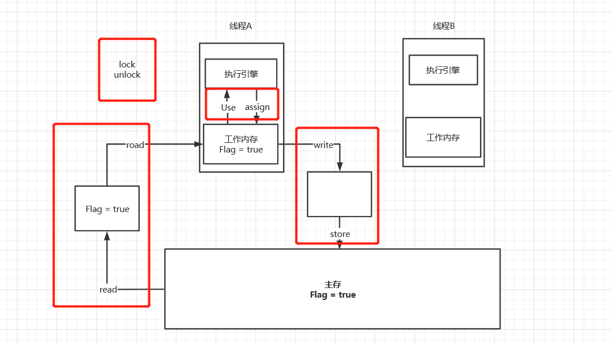

问题所在：线程A使用的Flag 不能及时所见

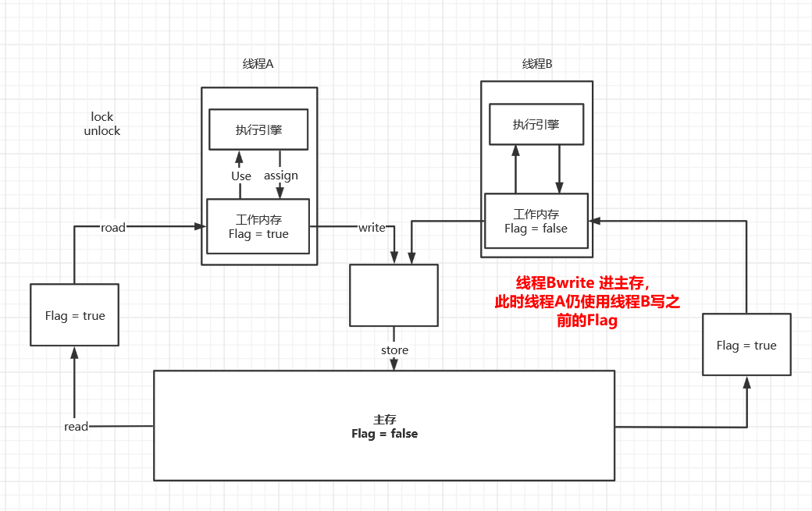

1. read(读取)：
   从主存中读取数据
2. load(载入)：
   将主存读取到的数据写入工作内存中
3. use(使用)：
   从工作内存读取数据做计算
4. assign(赋值)：
   将计算好的值重新赋值到工作内存中
5. store(存储)：
   将工作内存数据写入主存
6. write(写入)：
   将store过去的变量值赋值给主存中的变量(更新主存)
7. lock(锁定)：
   将主存变量加锁，标识为线程独占状态
8. unlock(解锁)：
   将主存变量解锁，解锁以后其它线程就可以锁定该变量。

#### 规则

- read和load，write和store必须成对出现，顺序执行（但不用连续执行）
- assign操作不允许丢弃，即，工作内存中变量改变必须同步给主内存
- use前必须有load，store前必须有assign
- 同一时间一个变量只能被一个线程lock，但该线程可对其lock多次，lock多少次，必须对应unlock对应次数才能解锁
- 如果一个线程lock了某个变量，改变量在工作内存中的值会被清空，使用前必须
- unlock前必须要把该变量写回主存


# Volatile

#### 1、保证可见性

```java

private volatile static int num = 0; //加入volatile 后可以保证在线程中 num 变量一直是最新的 ,不加入时线程不知道num已经改变会一直循环执行 //可验证其可见性！
    public static void main(String[] args) { //main 线程


        new Thread(()->{
            while (num==0){

            }
        }).start();

        try {
            TimeUnit.SECONDS.sleep(2);
        } catch (InterruptedException e) {
            e.printStackTrace();
        }
        num = 1;
        System.out.println(num);

    }
```

#### 2、不保证原子性

原子性：不可分割

线程A在执行任务的时候是不能被打扰的也不能被分割。要么同时成功，要么同时失败

```java
//不保证原子性
public class VDemo02 {
    private volatile static int num = 0;
    public static void add(){
        num++;
    }
    //理论上互不干扰，结果为2w ,多线程存在同步执行问题，volatile 不保证原子性  //main 19886
    public static void main(String[] args) {
        for (int i = 1; i <= 20 ; i++) {
            new Thread(()->{
                for (int j = 0; j < 1000; j++) {
                    add();
                }
            }).start();
        }
        while (Thread.activeCount()>2){ //main gc
            Thread.yield();
        }
        System.out.println(Thread.currentThread().getName() + " " + num);
    }

}
```

2、如果不加synchronized 和 lock 如何保证原子性？

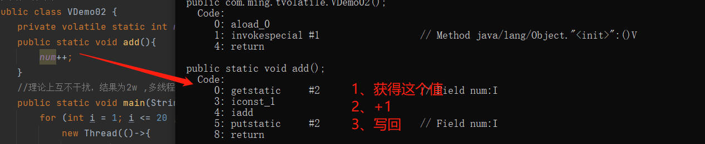

使用原子类，可以解决原子性 问题

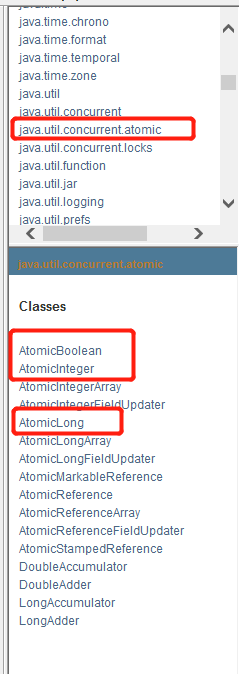

```java
//原子类的 Integer
    private volatile static AtomicInteger num = new AtomicInteger();
    public static void add(){
        num.getAndIncrement(); // +1 方法 底层用的是 CAS
    }
```

这些类的底层直接和操作系统挂钩可以在内存中修改值，比锁更高效！unsafe类！


#### 3、禁止指令重排

> 什么是指令重排？？

你写的程序代码顺序，计算机底层并不是按照你写的顺序去执行。

源代码-->编译器优化重排-->指令并行也可能重排-->内存系统会重排 --> 执行

**处理器在进行指令重排的时候会考虑数据之间的依赖性！**

```
int x = 1; //1
int x = 2; //2
x = x + 5; //3
y = x * x; //4

期望的顺序：1234    有可能指令重排： 2134 1324
但不可能会 4123!
```

可能造成的结果：a b x y 这四个值默认都是0；

| 线程A | 线程B |
| ----- | ----- |
| x=a   | y=b   |
| b=1   | a=2   |

正常执行后 x= 0 ；y = 0 但由于指令重排可能会：

| 线程A | 线程B |
| ----- | ----- |
| b=1   | a=2   |
| x=a   | y=b   |

这样就会影响了结果导致x = 2;y = 1;

加入volatile 可以避免指令重排

内存屏障---CPU指令。作用：

1. 保证特定的操作执行顺序！
2. 可以保证某些变量的内存可见性

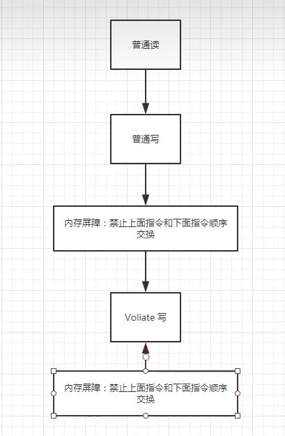


# 彻底玩转单例模式

> 饿汉式

```java
//饿汉式单例
public class Hungry {

    //可能会浪费空间
    private byte[] data1 = new byte[1024*1024];
    private byte[] data2 = new byte[1024*1024];
    private byte[] data3 = new byte[1024*1024];
    private byte[] data4 = new byte[1024*1024];

    private Hungry(){

    }
    private final static Hungry HUNGRY = new Hungry();

    public static Hungry getInstance(){
        return HUNGRY;
    }
}
```

> DCL 懒汉式

```java
//懒汉式单例
public class LazyMan {

    private static boolean check = false;

    private LazyMan(){
        //加锁
//        synchronized (LazyMan.class){
//            if (lazyMan!=null){
//                throw new RuntimeException("不要试图使用反射破坏异常");
//            }
//        }
        //增加 标志位 check
        synchronized (LazyMan.class){
            if (check == false){
                check = true;
            }
            else {
                throw new RuntimeException("不要试图使用反射破坏异常");
            }
        }

        System.out.println(Thread.currentThread().getName() + "ok");
    }
    private volatile static LazyMan lazyMan;

    //双重检测锁模式 懒汉式单例 DCL懒汉式
    public static LazyMan getInstance(){
        if (lazyMan==null){
            synchronized (LazyMan.class){
                if(lazyMan==null){
                    lazyMan = new LazyMan(); //不是原子性操作
                    /**
                     * 1、分配内存空间
                     * 2、执行构造方法，初始化对象
                     * 3、把这个对象指向这个空间
                     *
                     * 当多线程下， 线程A lazyman 还没有构造完毕，B线程进来，就会走lazyman!=null 所以需要加上volatile 避免指令重排和保证可见性。
                     */
                }
            }

        }
        return lazyMan;
    }


//    //单线程下没问题，但多线程下会出问题，需要加锁
//    public static void main(String[] args) {
//        for (int i = 0; i < 10; i++) {
//            new Thread(()->{
//                LazyMan.getInstance();
//            }).start();
//        }
//    }

    //反射获取！
    public static void main(String[] args) throws Exception {
//        LazyMan instance = LazyMan.getInstance();
//        Constructor<LazyMan> declaredConstructor = LazyMan.class.getDeclaredConstructor(null);
//        declaredConstructor.setAccessible(true); //无视私有构造器
//        LazyMan instance2 = declaredConstructor.newInstance();
//        System.out.println(instance);
//        System.out.println(instance2);
        //com.ming.single.LazyMan@1540e19d
        //com.ming.single.LazyMan@677327b6
        //解决办法：构造器加锁！


//        LazyMan instance = LazyMan.getInstance();
        Constructor<LazyMan> declaredConstructor = LazyMan.class.getDeclaredConstructor(null);
        declaredConstructor.setAccessible(true); //无视私有构造器
        LazyMan instance1 = declaredConstructor.newInstance();
        LazyMan instance2 = declaredConstructor.newInstance();
        System.out.println(instance1);
        System.out.println(instance2);
//        com.ming.single.LazyMan@1540e19d
//        com.ming.single.LazyMan@677327b6
        //解决办法： 设置 一个标志位 private static boolean check = false;

        //若找到内部设置的隐藏的变量仍可以破解： Field check = LazyMan.class.getDeclaredField("check");
        //                               check.setAccessible(true);
        //                               LazyMan instance1 = declaredConstructor.newInstance();
        //                               check.set(instance,false);
        //                               LazyMan instance2 = declaredConstructor.newInstance();
    }
}
```

> 静态内部类

```java
//静态内部类
//也是不安全，可以通过反射破解
public class Holder {
    private Holder(){

    }
    public static Holder getInstance(){
        return InnerClass.HOLDER;
    }
    public static class InnerClass{
        private static final Holder HOLDER = new Holder();
    }
}
```

单例不安全！可以通过反射破解！

枚举类可以不被反射破解！

> 枚举类

```java
// enum? => 枚举本事也是Class类
public enum EnumSingle {
    INSTANCE;
    public EnumSingle getInstance(){
        return INSTANCE;
    }
}

class Test{
    public static void main(String[] args) throws NoSuchMethodException, InvocationTargetException, InstantiationException, IllegalAccessException {
        EnumSingle instance1 = EnumSingle.INSTANCE;
//        Constructor<EnumSingle> declaredConstructor = EnumSingle.class.getDeclaredConstructor(null);
        Constructor<EnumSingle> declaredConstructor = EnumSingle.class.getDeclaredConstructor(String.class,int.class);
        declaredConstructor.setAccessible(true);
        EnumSingle instance2 = declaredConstructor.newInstance();
        //Exception in thread "main" java.lang.NoSuchMethodException: com.ming.single.EnumSingle.<init>()
        //没有空参构造器，需要去源码分析  javap -p EnumSingle.class 发现里面也有空参构造器
        // 需要使用jad 反编译 发现里面是一个有参构造器

        //最后成功获得预期的报错：  Exception in thread "main" java.lang.IllegalArgumentException: Cannot reflectively create enum objects
        //不能破坏枚举的单例
        System.out.println(instance1);
        System.out.println(instance2);

    }
}
```


# CAS

#### 什么是CAS？

=>CAS   -- compareAndSet : 比较并交换

```java
public class CASDemo {
    //CAS compareAndSet : 比较并交换
    public static void main(String[] args) {
        AtomicInteger atomicInteger = new AtomicInteger(2020);
        //期望的值 ，更新的值
//        public final boolean compareAndSet(int expect, int update)
        //如果期望的值达到了，那么就更新，否则就不更新，CAS是CPU的并发原语
        //true
        //2021
        //false
        //2021
        System.out.println(atomicInteger.compareAndSet(2020, 2021));
        System.out.println(atomicInteger.get());
        System.out.println(atomicInteger.compareAndSet(2020, 2021));
        System.out.println(atomicInteger.get());
    }
}
```


#### Unsafe类？

=>Java 无法直接操作内存，通过调用C++(native)去操作内存，而Unsafe类就是Java的内存，通过它可以去操作内存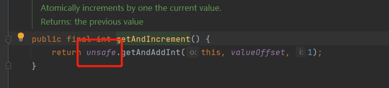

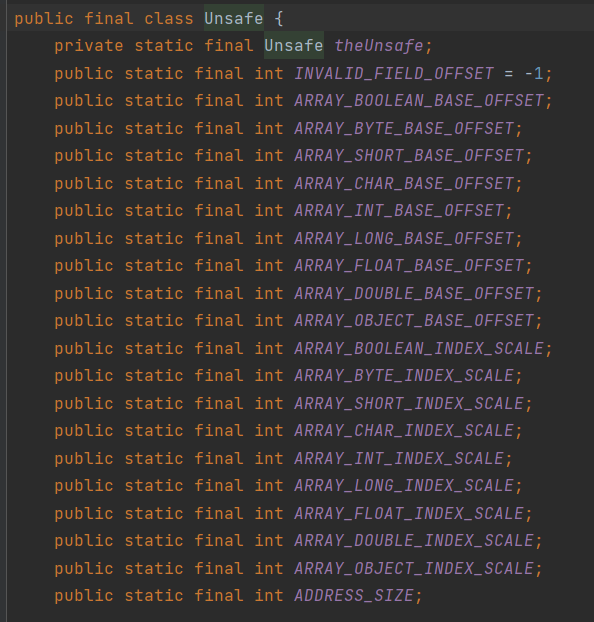


> getAndIncrement()

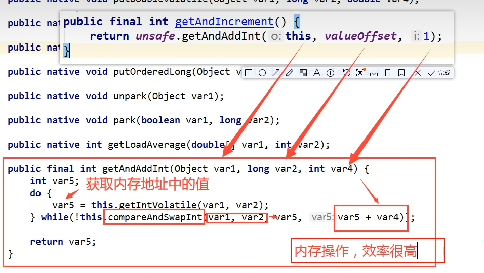

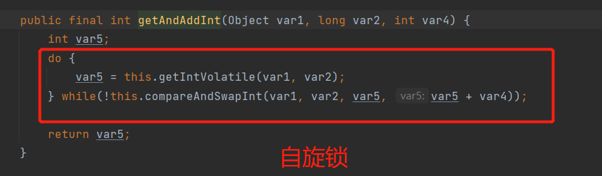


最后：

**CAS会涉及到ABA问题！**


# 原子引用

#### 什么是ABA问题？

=>  CAS机制的原理由CPU支持的原子操作，其原子性是在硬件层面进行保证的。而CAS机制可能会出现ABA问题，**即T1读取内存变量为A,T2修改内存变量为B,T2修改内存变量为A,这时T1再CAS操作A时是可行的。但实际上在T1第二次操作A时，已经被其他线程修改过了。**


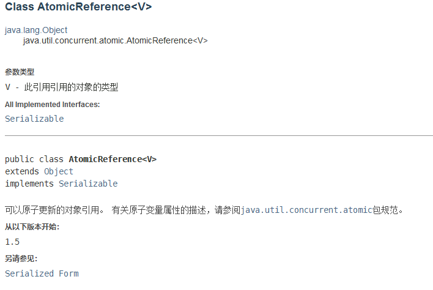

ABA问题解决：带版本号的原子操作！

坑：**Integer使用了对象缓存机制，默认范围是 -128 ~ 127,推荐使用静态工厂方法value Of获取对象实例，而不是new,因为value Of使用缓存，而 new 一定会创建新的对象分配新的内存空间；**

```java
 //如果泛型是包装类，注意引用类型
        AtomicStampedReference<Integer> atomicStampedReference = new AtomicStampedReference<>(1, 1);
        new Thread(()->{
            int stamp = atomicStampedReference.getStamp(); //获得版本号
            System.out.println("a1=>"+stamp);
            try {
                TimeUnit.SECONDS.sleep(1);
            } catch (InterruptedException e) {
                e.printStackTrace();
            }
            System.out.println(atomicStampedReference.compareAndSet(1, 2, atomicStampedReference.getStamp(), atomicStampedReference.getStamp() + 1));
            System.out.println("a2=>"+atomicStampedReference.getStamp());
            System.out.println(atomicStampedReference.compareAndSet(2, 1, atomicStampedReference.getStamp(), atomicStampedReference.getStamp() + 1));
            System.out.println("a3=>"+atomicStampedReference.getStamp());

        },"a").start();

        new Thread(()->{
            int stamp = atomicStampedReference.getStamp();
            System.out.println("b1=>"+stamp);
            try {
                TimeUnit.SECONDS.sleep(2);
            } catch (InterruptedException e) {
                e.printStackTrace();
            }
            System.out.println(atomicStampedReference.compareAndSet(1, 6, stamp, stamp + 1));
            System.out.println("b1=>"+atomicStampedReference.getStamp());

        },"b").start();
```


# 各种锁

#### 1、公平锁、非公平锁

公平锁：非常公平，不能够插队，必须先来后到

非公平锁：非常不公平，可以插队

```java
//lock 锁默认是非公平锁
public ReentranLock(){
    sync = new NonfairSync();
}
public ReentranLock(){
    sync = fair ?new FairSync():new NonfairSync();
}
```


#### 2、可重入锁

```java
public class Demo02 {
    public static void main(String[] args) {
        Phone phone = new Phone();
        new Thread(()->{
            phone.sms();
        },"A").start();
        //A中有重入锁，必须等A中的call调用完解锁才能到B
        new Thread(()->{
            phone.sms();
        },"B").start();
    }
}

class Phone2{
    Lock lock = new ReentrantLock();
    //锁必须配对，否则会死锁
    public void sms(){
        lock.lock();

        try {
            System.out.println(Thread.currentThread().getName() + "sms");
            call(); //这里也有锁
        } catch (Exception e) {
            e.printStackTrace();
        } finally {
            lock.unlock();
        }

    }

    public void call(){
        Lock lock = new ReentrantLock();
        try {
            System.out.println(Thread.currentThread().getName() + "call");
        } catch (Exception e) {
            e.printStackTrace();
        } finally {
            lock.unlock();
        }
    }
}
```

#### 3、自旋锁

```java
package com.ming.lock;

import java.util.concurrent.atomic.AtomicReference;

/**
 * 自旋锁
 */
public class SpinlockDemo {
    AtomicReference<Thread> atomicReference = new AtomicReference<>();

    //加锁
    public void myLock(){
        Thread thread = Thread.currentThread();
        System.out.println(Thread.currentThread().getName() + "==>mylock");
        while(!atomicReference.weakCompareAndSet(null,thread)){

        }
    }

    //加锁
    public void myUnLock(){
        Thread thread = Thread.currentThread();
        System.out.println(Thread.currentThread().getName() + "==>myunlock");
        atomicReference.compareAndSet(thread,null);
    }
}

```

```java
package com.ming.lock;

import java.util.concurrent.TimeUnit;

//T1==>mylock
//T2==>mylock
//T1==>myunlock
//T2==>myunlock
public class TestSpinLock {
    public static void main(String[] args) throws InterruptedException {
        SpinlockDemo lock = new SpinlockDemo();

        new Thread(()->{
            lock.myLock();
            try {
                TimeUnit.SECONDS.sleep(3);
            } catch (Exception e) {
                e.printStackTrace();
            } finally {
                lock.myUnLock();
            }

        },"T1").start();

        TimeUnit.SECONDS.sleep(1);

        new Thread(()->{
            lock.myLock();
            try {

            } catch (Exception e) {
                e.printStackTrace();
            } finally {
                lock.myUnLock();
            }

        },"T2").start();
    }
}
```

#### 4、死锁排查

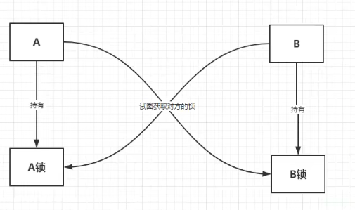

死锁：**在多道程序环境中，多个进程可以竞争有限数量的资源。当一个进程申请资源时，如果这时没有可用资源，那么这个进程进入等待状态。有时，如果所申请的资源被其他等待进程占有，那么该等待进程有可能再也无法改变状态。这种情况称为死锁。**(即多个线程争抢有限的共享资源，线程间互相等待对方释放资源形成死循环而造成死锁)

死锁的四个必要条件：

1. **互斥条件:** 一个资源每次只能被一个进程使用;
2. **请求与保持条件**: 一个进程因请求资源而阻塞时,对已获得的资源保持不放;
3. **不剥夺条件**: 进程已获得的资源,在末使用完之前,不能强行剥夺;
4. **循环等待条件**: 若干进程之间形成一种头尾相接的循环等待资源关系;


```java
package com.ming.lock;

import java.util.concurrent.TimeUnit;

public class DeadLockDemo {
    public static void main(String[] args) {
        String lockA = "lockA";
        String lockB = "lockB";
        new Thread(new MyThread(lockA,lockB),"T1").start();
        new Thread(new MyThread(lockB,lockA),"T2").start();
    }


}

class MyThread implements Runnable{

    private String lockA;
    private String lockB;

    public MyThread(String lockA,String lockB){
        this.lockA = lockA;
        this.lockB = lockB;
    }
    @Override
    public void run() {
        synchronized (lockA){
            System.out.println(Thread.currentThread().getName()+ "lock:"+lockA+"=>lock:"+lockB);

            try {
                TimeUnit.SECONDS.sleep(2);
            } catch (InterruptedException e) {
                e.printStackTrace();
            }
            synchronized (lockB){

            }
        }

    }
}

```

> 解决方法

1、使用 jps -l 定位进程号

2、使用jstack 进程号 找到死锁问题

